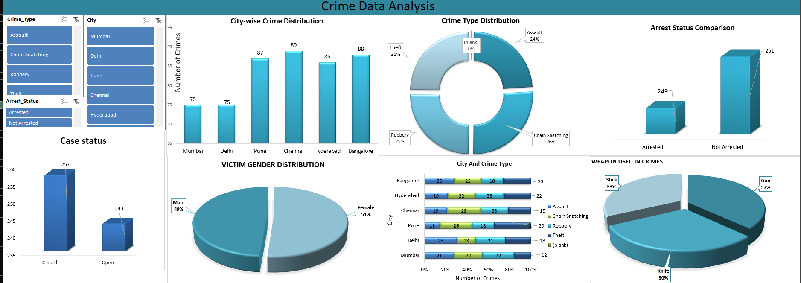

# 🚨 Crime Data Analysis Dashboard

## 📊 Project Overview
This project analyzes crime data using Microsoft Excel to identify patterns, trends, and key insights.  
An interactive dashboard is created using Pivot Tables, Charts, and Slicers.

---

## 🎯 Objectives
- Identify city-wise crime distribution  
- Analyze most common crime types  
- Compare arrested vs non-arrested cases  
- Study victim gender distribution  
- Understand severity levels and weapon usage  

---

## 📁 Dataset Description
- Total Records: 500  
- Fields Included:
  - City  
  - Crime Type  
  - Arrest Status  
  - Victim Gender  
  - Severity Level  
  - Weapon Used  

---

## 🧹 Data Cleaning & Preparation
- Removed blank values  
- Converted time format (12-hour format)  
- Structured dataset for analysis  
- Created new columns (Day/Night analysis)  

---

## 🛠️ Tools & Techniques Used
- Microsoft Excel  
- Pivot Tables  
- Charts (Bar, Pie, Column)  
- Slicers for interactivity  

---

## 📈 Dashboard Features
- Interactive filters using slicers  
- City-wise crime comparison  
- Crime type distribution  
- Arrest status insights  
- Visual representation using charts  

---

## 📷 Dashboard Preview

---

## 👥 Target Users
- Law Enforcement Agencies  
- Government Authorities  
- Data Analysts  
- Researchers  

---

## 📌 Conclusion
This project simplifies complex crime data into meaningful insights, helping in better understanding and decision-making.

---

## 📎 Project Files
- Excel Dashboard  
- Dataset  
- PDF Presentation  
